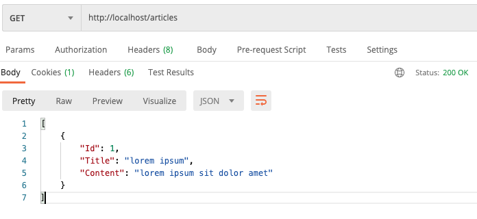

# YiiDock 

Pre Configuration Docker for Development Yii 3.0 + MySQL

## Getting started

Clone Yii3 demo to folder src

```
git clone https://github.com/yiisoft/yii-demo.git src
```

Then, build image

```sh
docker-compose up --build
```

You can check service with execute: `docker-compose ps`

```
        Name                      Command               State                 Ports              
-------------------------------------------------------------------------------------------------
yiidock_app_1          docker-php-entrypoint php-fpm    Up      9000/tcp                         
yiidock_mysql_1        docker-entrypoint.sh mysqld      Up      0.0.0.0:3306->3306/tcp, 33060/tcp
yiidock_nginx_1        nginx -g daemon off;             Up      0.0.0.0:80->80/tcp               
yiidock_phpmyadmin_1   /docker-entrypoint.sh apac ...   Up      80/tcp 
```

Before acceess service, wait until `composer install` done. 

```
docker-compose logs -f app
```

## Available service:

- GET http://localhost



- GET http://localhost/phpmyadmin

## Usage

After edit code, You can reload `docker-compose restart app`

To check error You can execute `docker-compose logs -f app`

## Readmore

- https://echo.labstack.com/guide


