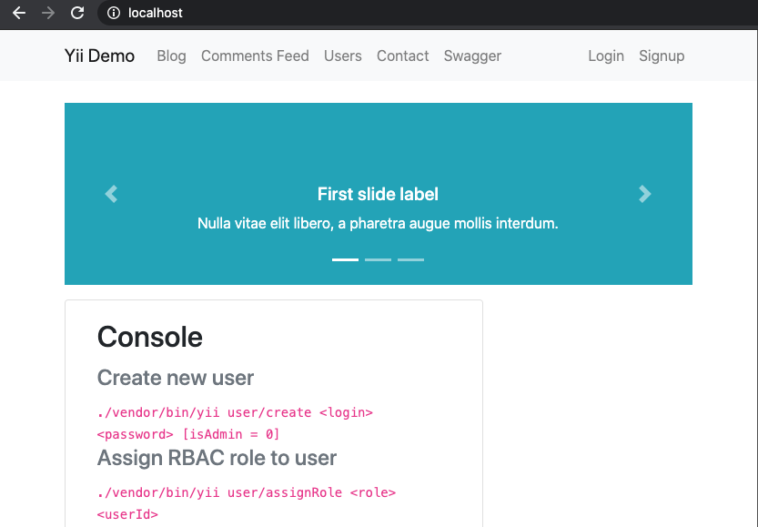

# GoDockRest 

Pre Configuration Docker for Golang Restful with Echo + MySQL

## Getting started

```sh
docker-compose up --build
```

You can check service with execute: `docker-compose ps`

```
      Name                     Command               State                 Ports              
----------------------------------------------------------------------------------------------
rest_app_1          go run ./app/server.go           Up      81/tcp                           
rest_mysql_1        docker-entrypoint.sh mysqld      Up      0.0.0.0:3306->3306/tcp, 33060/tcp
rest_nginx_1        nginx -g daemon off;             Up      0.0.0.0:80->80/tcp               
rest_phpmyadmin_1   /docker-entrypoint.sh apac ...   Up      80/tcp  
```

## Available service:

- GET http://localhost
- GET http://localhost/articles



- GET http://localhost/articles/1

- GET http://localhost/phpmyadmin

## Usage

After edit code, You can reload `docker-compose restart app`

To check error You can execute `docker-compose logs -f app`

## Readmore

- https://echo.labstack.com/guide


